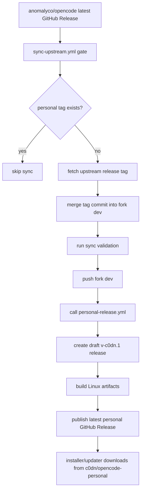

# Personal Release Sync — Current Architecture

## Purpose

This document captures the current architecture of `c0dn/opencode-personal`'s upstream-release sync and personal release channel before planning a sync to upstream 1.16.

It is a current-state map, not an implementation plan.

## Scope

- Upstream release sync automation.
- Personal release publishing automation.
- CLI installer and updater release-channel behavior.
- Build target filtering and release asset naming.
- Version/tag ownership and validation gates.

## Current state

This fork keeps a small personal patch stack on top of upstream `anomalyco/opencode`. The release-channel patch stack is concentrated in:

- `.github/workflows/sync-upstream.yml`
- `.github/workflows/personal-release.yml`
- `install`
- `packages/opencode/src/installation/index.ts`
- `packages/opencode/script/build.ts`
- `packages/opencode/test/installation/installation.test.ts`
- `CHANGELOG.personal.md`

The branch under inspection was `sync/release-1-16` in `/home/william/projects/worktrees/opencode-personal-sync-release-1-16`, with `origin` set to `c0dn/opencode-personal` and `upstream` set to `anomalyco/opencode`.

## Release and sync flow



### Upstream sync automation

`.github/workflows/sync-upstream.yml` is scheduled daily and can be run manually. Its gate job reads `repos/anomalyco/opencode/releases/latest`, strips the upstream `v`, computes `<upstream-version>-c0dn.1`, and skips when the corresponding personal release already exists (`.github/workflows/sync-upstream.yml:24-45`).

When a personal mirror is missing, the sync job checks out fork `dev`, fetches the upstream release tag, resolves it to a commit, and merges that commit into fork `dev` (`.github/workflows/sync-upstream.yml:56-83`). It then runs:

- `bun typecheck`
- `bun turbo test:ci`
- `bun run test:httpapi` from `packages/opencode`

Only after these gates pass does it push `HEAD:dev` (`.github/workflows/sync-upstream.yml:90-104`). The final job calls `personal-release.yml` with the computed personal version and `ref: dev` (`.github/workflows/sync-upstream.yml:113-121`).

Important drift: `CHANGELOG.personal.md` currently says this workflow merges `anomalyco/opencode:dev` and mirrors when the upstream tag is contained in `dev`, but the workflow actually fetches and merges the latest upstream release tag commit directly (`CHANGELOG.personal.md:89-94`, `.github/workflows/sync-upstream.yml:67-83`).

### Personal release publishing

`.github/workflows/personal-release.yml` supports both manual `workflow_dispatch` and reusable `workflow_call` entry points with `version` and optional `ref` inputs (`.github/workflows/personal-release.yml:3-23`).

The workflow normalizes a leading `v`, creates tag `v${version}`, then runs targeted release-channel checks:

- `bun --cwd packages/opencode typecheck`
- `bun --cwd packages/opencode test test/installation/installation.test.ts`

It creates a draft GitHub Release, then builds and uploads artifacts with:

- `OPENCODE_VERSION=${version}`
- `OPENCODE_RELEASE=1`
- `OPENCODE_BUILD_TARGETS=linux-x64,linux-arm64`

Finally it publishes the draft release as latest (`.github/workflows/personal-release.yml:44-80`).

## Installer/updater release channel

### Installer

The top-level `install` script points users at `https://raw.githubusercontent.com/c0dn/opencode-personal/dev/install` (`install:22-25`). It installs into `$HOME/.opencode/bin` (`install:68-69`).

The personal installer intentionally supports only:

- `linux-x64`
- `linux-arm64`

All other OS/arch combinations are rejected (`install:102-110`). Linux musl is rejected, and Linux x64 without AVX2 is rejected (`install:118-170`).

The installer constructs release asset names as `opencode-${target}${archive_ext}`. For Linux this becomes `opencode-linux-x64.tar.gz` or `opencode-linux-arm64.tar.gz` (`install:172-180`). It downloads latest or specific versions from `https://github.com/c0dn/opencode-personal/releases/...` and reads latest version metadata from the fork's GitHub Releases API (`install:195-215`).

### CLI updater

`packages/opencode/src/installation/index.ts` is the runtime update service. The fork-specific constants are:

- `repo = "c0dn/opencode-personal"`
- `install = https://raw.githubusercontent.com/c0dn/opencode-personal/dev/install`
- a package-manager upgrade block message

These appear at `packages/opencode/src/installation/index.ts:74-76`.

`Installation.latest()` reads `https://api.github.com/repos/c0dn/opencode-personal/releases/latest` and returns the tag without a leading `v` (`packages/opencode/src/installation/index.ts:180-188`). `Installation.upgrade()` only allows the `curl` path; every other detected install method returns `UpgradeFailedError` with the personal-build block message (`packages/opencode/src/installation/index.ts:189-199`).

## Build and version ownership

`packages/script/src/index.ts` owns build-time version/channel derivation. If `OPENCODE_VERSION` is set and is not a `0.0.0-*` preview, the channel becomes `latest`; `Script.version` is exactly `OPENCODE_VERSION`; `Script.release` is true when `OPENCODE_RELEASE` is set (`packages/script/src/index.ts:20-48`, `packages/script/src/index.ts:60-72`).

`packages/opencode/script/build.ts` embeds `OPENCODE_VERSION`, `OPENCODE_CHANNEL`, and Linux libc into the compiled binary (`packages/opencode/script/build.ts:197-204`). It defines the full upstream target matrix, derives stable target IDs such as `linux-x64`, and filters by `OPENCODE_BUILD_TARGETS` when present (`packages/opencode/script/build.ts:53-153`).

In release mode, build artifacts are archived as tarballs for Linux and zip files for other platforms. The personal workflow filters to Linux only, so the expected uploaded assets are:

- `opencode-linux-x64.tar.gz`
- `opencode-linux-arm64.tar.gz`

The upload uses `gh release upload v${Script.version}` with `GH_REPO` supplied by the workflow (`packages/opencode/script/build.ts:237-252`, `.github/workflows/personal-release.yml:68-75`).

Runtime version constants come from compile-time globals in `packages/core/src/installation/version.ts`. Personal versions such as `1.15.13-c0dn.1` are normalized to the upstream semver core for dependency compatibility by `normalizeInstallationDependencyVersion()` (`packages/core/src/installation/version.ts:8-18`).

## State ownership

| State | Owner | Notes |
| --- | --- | --- |
| Upstream release tags | `anomalyco/opencode` | Read through GitHub Releases and fetched by tag. |
| Fork `dev` branch | `c0dn/opencode-personal` | Sync workflow merges validated upstream release commits here. |
| Personal release tags | `c0dn/opencode-personal` | Automated mirrors use `v<upstream-version>-c0dn.1`. |
| Personal release assets | `c0dn/opencode-personal` | Linux x64/arm64 tarballs only. |
| Build-time version | `OPENCODE_VERSION` | Injected by `personal-release.yml`. |
| Build target subset | `OPENCODE_BUILD_TARGETS` | Personal workflow sets `linux-x64,linux-arm64`. |
| Installed binary | `$HOME/.opencode/bin/opencode` | Installer/updater-supported path. |

## Invariants and constraints

- Default release/sync branch is `dev` (`AGENTS.md:26-29`, `.github/workflows/sync-upstream.yml:56-59`).
- Automated personal mirrors use `v<upstream-version>-c0dn.1` (`.github/workflows/sync-upstream.yml:30-36`).
- Manual personal releases accept a version with or without leading `v` (`.github/workflows/personal-release.yml:44-50`).
- Published personal CLI artifacts are Linux-only (`.github/workflows/personal-release.yml:68-75`, `install:102-110`).
- Package-manager upgrades are blocked for personal builds; GitHub-release/curl upgrades are the supported path (`packages/opencode/src/installation/index.ts:74-76`, `packages/opencode/src/installation/index.ts:189-199`).
- Installer and build script asset naming must stay aligned: `opencode-linux-x64.tar.gz` and `opencode-linux-arm64.tar.gz` (`install:180`, `packages/opencode/script/build.ts:237-252`).

## Likely upstream-sync conflict hotspots

These are the areas that need focused comparison against upstream 1.16 before any cherry-pick or reimplementation decision:

1. `packages/opencode/src/installation/index.ts` — upstream changes to updater methods, release lookup, Effect HTTP/process APIs, events, or upgrade error handling may overlap the personal repo/blocked-upgrade patch.
2. `install` — upstream changes to platform detection, archive naming, install directory behavior, PATH handling, CPU/libc support, or download URLs may overlap the Linux-only personal installer.
3. `packages/opencode/script/build.ts` — upstream changes to target matrix, Bun compile options, embedded web UI, smoke tests, artifact packaging, or release upload may overlap `OPENCODE_BUILD_TARGETS` and Linux asset filtering.
4. `.github/workflows/*.yml` — upstream workflow changes may not textually conflict, but the personal workflows encode fork-specific release semantics and should not be blindly replaced.
5. `packages/core/src/installation/version.ts` and plugin dependency install paths — upstream version compatibility changes may interact with `-c0dn.N` normalization.
6. `CHANGELOG.personal.md` — currently contains stale automation wording and should be corrected once the intended sync behavior is confirmed.

## Validation commands

Minimum targeted checks for release-channel changes:

```bash
bun --cwd packages/opencode typecheck
bun --cwd packages/opencode test test/installation/installation.test.ts
```

Full sync workflow gates currently run:

```bash
bun typecheck
bun turbo test:ci
bun --cwd packages/opencode run test:httpapi
```

Personal release build smoke command:

```bash
OPENCODE_VERSION=<version> \
OPENCODE_RELEASE=1 \
OPENCODE_BUILD_TARGETS=linux-x64,linux-arm64 \
bun ./packages/opencode/script/build.ts
```

For local targeted release build validation without publishing, use the existing build-script flag to avoid release upload unless upload behavior is being tested:

```bash
OPENCODE_VERSION=<version> \
OPENCODE_BUILD_TARGETS=linux-x64,linux-arm64 \
bun ./packages/opencode/script/build.ts --skip-embed-web-ui
```

## Open questions before planning the 1.16 sync

- Which exact upstream 1.16 tag should be treated as the target release?
- Does the corresponding personal release already exist remotely?
- Did upstream 1.16 change any hotspot files listed above?
- Is the current workflow behavior, merging the latest upstream release tag commit directly, intentional? If yes, `CHANGELOG.personal.md` should be updated to match reality.
- If upstream changes artifact names or target IDs, should the personal fork keep the current Linux-only `opencode-linux-{x64,arm64}.tar.gz` contract or adapt installer/build behavior?
